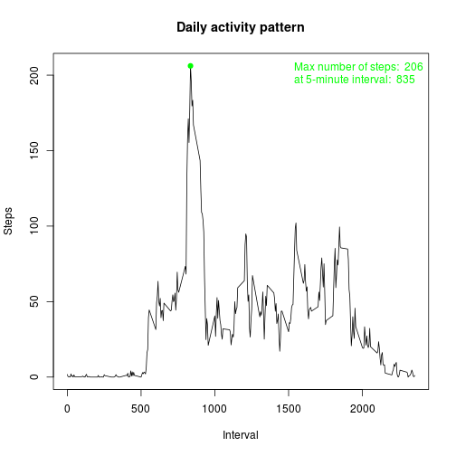
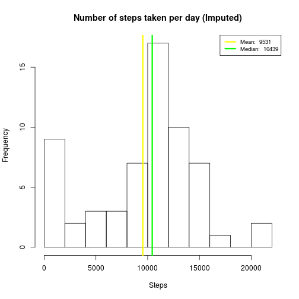

# Reproducible Research: Peer Assessment 1

## Setting up the environment


```r
rm(list=ls(all=TRUE))

Sys.setlocale("LC_TIME","en_US.UTF-8")
```

```
## [1] "en_US.UTF-8"
```

```r
if (!("dplyr" %in% rownames(installed.packages()))){
    install.packages("dplyr", repos="http://cran.rstudio.com/")
}
library(dplyr)
```

```
## 
## Attaching package: 'dplyr'
## 
## The following objects are masked from 'package:stats':
## 
##     filter, lag
## 
## The following objects are masked from 'package:base':
## 
##     intersect, setdiff, setequal, union
```

```r
if (!("lattice" %in% rownames(installed.packages())) ){
    install.packages("lattice", repos="http://cran.rstudio.com/")
}
library(lattice)
```

## Loading and preprocessing the data


```r
if (!file.exists('activity.csv')) {
    unzip(zipfile = 'activity.zip')
}
activity <- read.csv('activity.csv')

activity <- mutate(activity, date = as.Date(date, "%Y-%m-%d"))

str(activity)
```

```
## 'data.frame':	17568 obs. of  3 variables:
##  $ steps   : int  NA NA NA NA NA NA NA NA NA NA ...
##  $ date    : Date, format: "2012-10-01" "2012-10-01" ...
##  $ interval: int  0 5 10 15 20 25 30 35 40 45 ...
```

```r
head(activity)
```

```
##   steps       date interval
## 1    NA 2012-10-01        0
## 2    NA 2012-10-01        5
## 3    NA 2012-10-01       10
## 4    NA 2012-10-01       15
## 5    NA 2012-10-01       20
## 6    NA 2012-10-01       25
```

```r
dim(activity)
```

```
## [1] 17568     3
```

## What is mean total number of steps taken per day?


```r
activityPerDay <- activity %>% 
                  select(steps, date) %>% 
                  group_by(date) %>% 
                  summarise(steps = sum(steps, na.rm = T))

hist(activityPerDay$steps
     ,breaks = 10
     ,main = "Number of steps taken per day"
     ,xlab = "Steps")

meanStepsPerDay <- mean(activityPerDay$steps)
medianStepsPerDay <- median(activityPerDay$steps)

abline(v=meanStepsPerDay, lwd = 3, col = 'yellow')
abline(v=medianStepsPerDay, lwd = 3, col = 'green')

legend('topright'
          ,lty = 1 , lwd = 3
          , col = c("yellow", "green"), cex = .8 
          ,legend = c(paste('Mean: ', round(meanStepsPerDay, 0))
                     ,paste('Median: ', round(medianStepsPerDay, 0))) 
      )
```

 

## What is the average daily activity pattern?


```r
activityPerInterval <- activity %>%
                       select(steps, interval) %>%
                       group_by(interval) %>%
                       summarise(steps = mean(steps, na.rm = T))

plot(activityPerInterval$steps ~ activityPerInterval$interval
     ,type = 'l'
     ,main = "Daily activity pattern"
     ,xlab = "Interval"
     ,ylab = "Steps")

maxStep <- activityPerInterval %>% filter(steps == max(steps))

points(x = maxStep$interval
      ,y = maxStep$steps
      ,col = "green", pch = 19)

legend("topright", text.col = "green", bty = "n", legend=c(paste("Max number of steps: ", round(maxStep$steps, 0)), paste("at 5-minute interval: ", round(maxStep$interval, 0)) ))
```

 

## Imputing missing values


```r
filledActivity <- activity

# For each NA result in steps, get
# the mean for that 5-minute interval
for(r in 1:nrow(filledActivity)){
    if (is.na(filledActivity$steps[r])) {
        filledActivity$steps[r] <- activityPerInterval$steps[r];
    }
}

filledActivityPerDay <- filledActivity %>% 
                        select(steps, date) %>% 
                        group_by(date) %>% 
                        summarise(steps = sum(steps, na.rm = T))

hist(filledActivityPerDay$steps
     ,breaks = 10
     ,main = "Number of steps taken per day (Imputed)"
     ,xlab = "Steps")

filledMeanStepsPerDay <- mean(filledActivityPerDay$steps)
filledMedianStepsPerDay <- median(filledActivityPerDay$steps)

abline(v=filledMeanStepsPerDay, lwd = 3, col = 'yellow')
abline(v=filledMedianStepsPerDay, lwd = 3, col = 'green')

legend('topright'
          ,lty = 1 , lwd = 3
          , col = c("yellow", "green"), cex = .8 
          ,legend = c(paste('Mean: ', round(filledMeanStepsPerDay, 0))
                     ,paste('Median: ', round(filledMedianStepsPerDay, 0))) 
      )
```

 

## Are there differences in activity patterns between weekdays and weekends?


```r
dayType <- weekdays(filledActivity$date) %in% c('Saturday','Sunday')

filledActivity$dayType <- as.factor(ifelse(dayType,'weekend', 'weekday'))

filledActivityPerInterval <- filledActivity %>%
                                select(steps, interval, dayType) %>%
                                group_by(interval, dayType) %>%
                                summarise(steps = mean(steps, na.rm = T))

xyplot(steps ~ interval | dayType
       ,data = filledActivityPerInterval
       ,layout = c(1,2)
       ,main = "Activity patterns between\n weekdays and weekends"
       ,type = 'l', xlab = 'Interval'
       ,ylab = 'Number of Steps')
```

 

